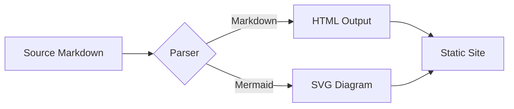

Welcome to my Arknights-themed blog! This is a test post to verify the theme works correctly.

明日方舟主題的 Hexo 部落格測試文章。

> "即使微光再渺茫，也要照亮前路。"

## 功能測試

以下是幾個主題功能的測試：

### Mermaid 圖表示例



### Code Highlighting

```javascript
function greet(name) {
    return `Hello, ${name}! Welcome to Rhodes Island.`;
}
console.log(greet("Doctor"));
```

### Admonition Blocks


這是提示訊息區塊，主題內建的 admonition 功能。



這是警告訊息區塊。



這是成功訊息區塊。


<!-- more -->

## 詳細內容

這是在 `<!-- more -->` 標籤之後的內容，不會顯示在首頁摘要中。

### 數學公式（需要額外設定）

如果要支援數學公式，需要額外安裝 `hexo-renderer-kramed` 並開啟 `mathjax` 設定。

### 其他功能

這個主題支援：
- 多種評論系統（Valine、Gitalk、Waline、Artalk、Utterances、Giscus）
- 數學公式（MathJax）
- 圖表（Mermaid）
- 字數/閱讀時間統計
- 網頁流量統計（Vercount）
- 文章加密
- 搜尋功能
- 自訂 CSS/JS
- Monaco Editor 程式碼編輯器嵌入
